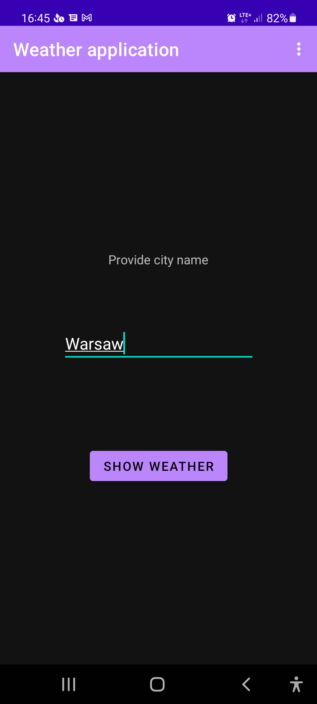
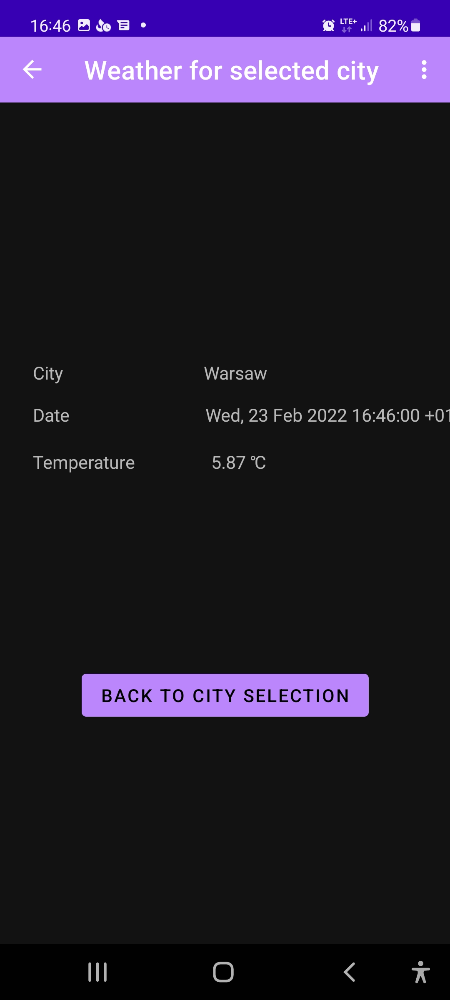

### Building

Put correct Openweather api key as APIKEY value in `build.gradle`.

OpenWeatherMap is free weather service, to create api key go to https://openweathermap.org/.

```bash
        buildConfigField "String", "API_KEY", "\"" + "abcd" + "\""
```

Then build:
```
./gradlew clean build
```

APK files can be found at:

`app/build/outputs/apk`

### Application

On first screen city name should be provided (see screenshot).



Then after tapping on `Show weather` button, weather is presented.


